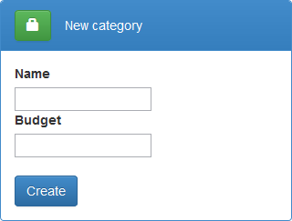
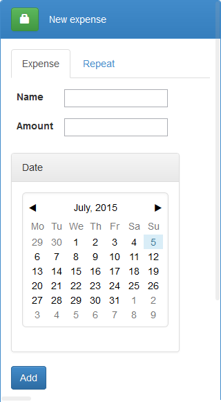
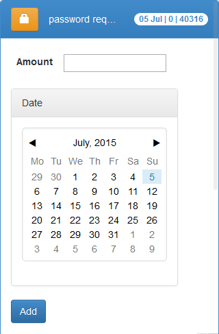
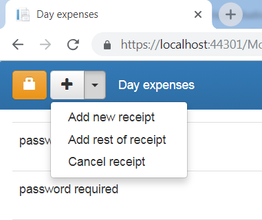
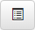

---
layout: default
--- 

> In the main menu select "New expense" and then select the category. If you don't have any categories yet, press "plus" button at the top of page. 

## Creating new expense category

> Type the category name and optionally category month budget.
> After that select expenses from list or add new expense.

## Adding expense

> Only at the first time you will need to input expense name.

## Optimized expense input

> Next time when you selected the expense from list you will need to input only amount. By default the current date is used, but any other can be selected from the calendar.

[Expense tracking](expense-tracking)

> 

> Start new receipt by selecting "Add Receipt" menu and add expenses grouping them by category. 

> By selecting "Add Rest of Receipt" you can record last group of expenses in receipt. Amount will be calculated by subracting sum of all other expenses for the day from given value. 

> To see receipt expenses open detailed view by pressing  button. They are separated from other day expenses and displayed at the top of list.


